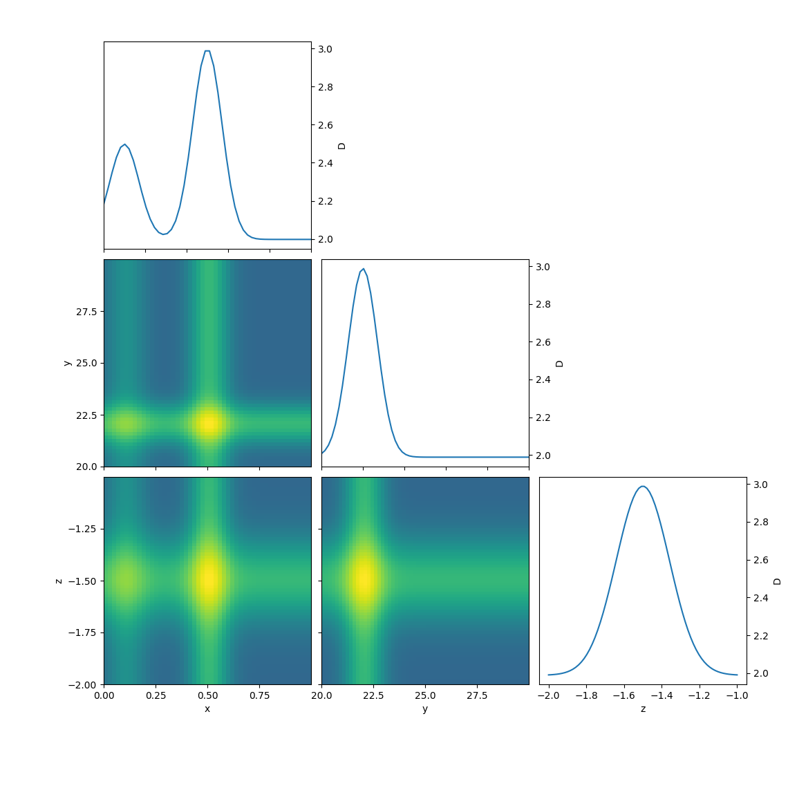

# Projection matrix plot

A `corner` plot for an array of dependent values

Given an `N` dimensional set of data (i.e. some function evaluated over a grid
of coordinates), plot all possible 1D and 2D projections in the style of a
[`corner` plot](http://corner.readthedocs.io/en/latest/pages/quickstart.html).

# Example

Generating some fake data and plotting:

```python
import numpy as np
import projection_matrix.projection_matrix as pmp

# Generate example data
x = np.linspace(0, 1, 50)
y = np.linspace(20, 30, 60)
z = np.linspace(-2, -1, 70)
x0, y0, z0 = 0.5, 22, -1.5
X, Y, Z = np.meshgrid(x, y, z, indexing='ij')
sigmax = 0.1
sigmay = 1
sigmaz = 0.2
D = (np.exp(-(X-x0)**2/sigmax**2)
     + np.exp(-(Y-y0)**2/sigmay**2)
     + np.exp(-(Z-z0)**2/sigmaz**2))

fig, axes = pmp(
    D, xyz=[x, y, z], labels=['x', 'y', 'z', 'D'], projection=np.max)
fig.savefig('example')
```


# Acknowledgements

The code uses both the central idea and some specific code from
[corner.py](https://github.com/dfm/corner.py)

